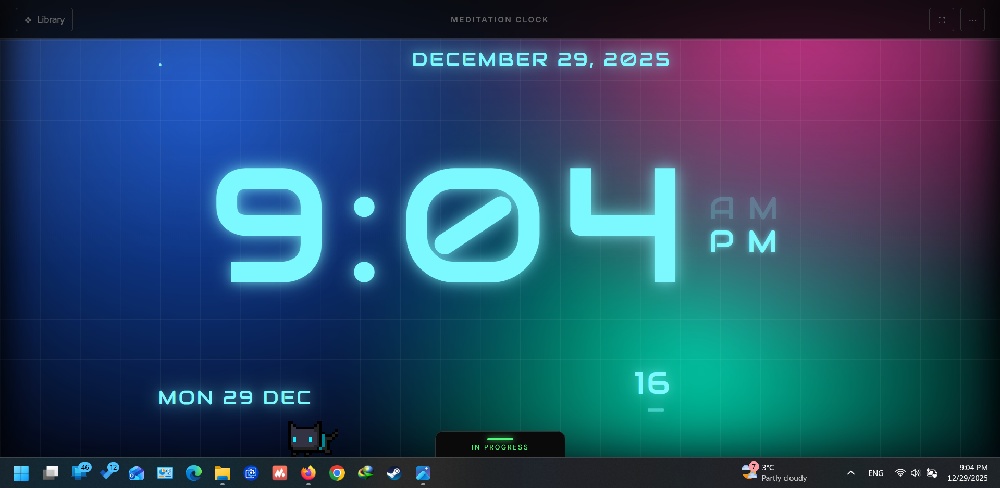

Meditation Clock

# Currently it's available to use at [ihummingbird.github.io/meditationclock/] (https://ihummingbird.github.io/meditationclock/) and [meditationclock.ihummingbird.workers.dev](https://meditationclock.ihummingbird.workers.dev)
## I'm working on a domain, if you want you can sponsor a domain for me :D

A distraction-free, environment for meditation.

I built this because I wanted a way to meditate with my eyes open without the clutter of modern interfaces. Most clock apps are too bright, have ads, or require subscriptions.

Meditation Clock is free, It runs entirely in your browser, saves your preferences locally, and is designed to disappear so you can focus on the flow of time.

 Core Features

    Zero Distractions: No ads, no tracking, no logins. It runs offline.

    True Immersion: A custom Fullscreen mode that hides the browser UI. Even the navigation bar fades away when not in use.

    Session Controller: A discreet bottom drawer to track meditation sessions. It uses a subtle "Green Line" indicator so you aren't distracted by ticking numbers while focusing.

    Persistent Settings: The engine remembers your favorite theme, colors, and zoom levels automatically using LocalStorage.

 The Themes

The system uses a modular "Engine" architecture. Each theme is a self-contained plugin with its own logic and visuals.

    Simple Digital: A high-contrast, monochromatic digital clock. Perfect for deep work or "Trataka" (candle gazing) meditation.

    Zen Enso (Deep Breathing): A visual breathing guide. The circle expands and contracts with a "liquid" glow effect. Fully customizable timings (4-7-8, Box Breathing, etc.).

    Standby Mode: Inspired by Apple's nightstand interface. Bold typography with a customizable color palette and font styles.

    Analog Standby: A fully functional analog clock paired with a live calendar generator. Includes a zoom slider to fit any screen size.

 How to Use

    Open it on https://ihummingbird.github.io/meditationclock/
    
    Or just download the code.

    Double-click index.html.

    That's it.

  Under the Hood (The Engine)

I wanted the code to be clean and extensible. The project is structured into a core Engine and modular Themes.

File Structure:
code Text

/core
  ├── engine.js      # The Brain (Handles time, saving, UI generation)
  └── global.css     # The Shell (Drawers, Navbar, Session logic)
/themes
  └── /theme-name    # Theme specific logic & styles (e.g. /simple, /ios)

  

Adding a New Theme

The engine is "dumb"—it doesn't know what a theme looks like until it loads it. To add your own:

    Duplicate an existing folder in /themes.

    Rename it (e.g., /matrix).

    Register it in core/engine.js:
    code JavaScript

        
    themes: [
        { id: 'matrix', name: 'The Matrix' }
    ]

      

    (Note: The id must match the folder name exactly).

 License

This project is open source at least for now, even if I make it close source I'll keep it free. Feel free to fork it, modify it, and use it to find your own peace of mind but don't monitize it!

Built without focus. :D
